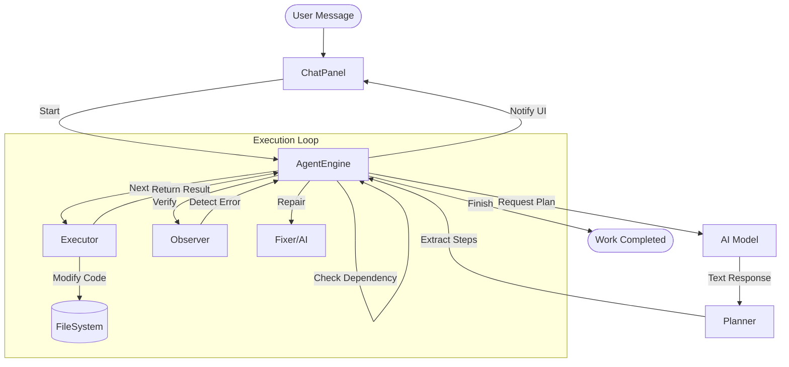

# Tokamak AI Agent Architecture

Tokamak AI Agent는 단순한 명령어 실행기에서 **자율 루프(Autonomous Loop)**를 가진 지능형 에이전트로 진화하고 있습니다. 현재 Phase 4인 **Global RAG (Semantic Search & Summarization)** 구현이 완료되었습니다.

## 1. 개요 (High-level)

에이전트는 사용자의 질문으로부터 계획을 수립하고, 그 계획의 각 단계(Step)를 자율적으로 실행하며, 결과를 관찰하고 필요시 스스로 수정하는 **Loop**를 가집니다.

## 2. 핵심 컴포넌트

### 1) AgentEngine (Core Control)
- 에이전트의 전체 상태를 관리하는 State Machine 기반 제어 엔진입니다.
- **상태 전이**: `Idle -> Planning -> Executing -> Observing -> Reflecting -> Fixing -> Done`
- 계획에 따른 실행 흐름을 지휘하며, 예외 발생 시 복구 루틴을 활성화합니다.

### 2) Planner (Intelligence)
- AI의 텍스트 응답에서 구조화된 계획(`PlanStep[]`)을 추출합니다.
- **의존성 추출**: 단계 간 선후 관계(`[depends: id]`)를 해석하여 실행 순서를 결정합니다.
- **Re-planning**: 실행 중 상황 변화에 따라 계획을 동적으로 수정할 수 있는 기반을 제공합니다.

### 3) Executor (Action Layer)
- 실제 VS Code 환경에서 액션을 수행하는 유틸리티입니다.
- **File Control**: `vscode.workspace.fs`를 직접 다루어 파일 생성, 수정(Search/Replace 포함), 삭제를 수행합니다.
- **Terminal Execution**: 빌드나 테스트 실행을 위해 통합 터미널을 호출합니다.

### 4) Observer & Reflection (Verification - 구현 완료)
- **Observer**: `vscode.languages.getDiagnostics()` API를 통해 현재 작업 영역의 모든 린트(Lint) 에러와 경고를 실시간으로 모니터링합니다. 
- **Error Summary**: 감지된 에러를 AI가 즉시 이해할 수 있도록 파일명, 라인 번호, 에러 메시지를 포함한 구조화된 텍스트로 요약하는 기능을 제공합니다.
- **Reflection**: AI가 실행 결과 및 Observer의 보고를 바탕으로 작업의 성공 여부를 판정하고, 필요 시 수정 방향을 결정합니다.

---

## 3. 세부 구현 로직 (Implementation Details)

### 3.1. Phase 2: 지능형 의존성 기반 자율 루프
에이전트는 단순 순차 실행이 아닌, 단계 간의 관계를 이해하고 실행합니다.
- **의존성 관리 (`dependsOn`)**: Planner가 생성한 각 단계의 ID를 추적하며, 선행 단계가 `done` 상태인 작업만 골라 실행 엔진(`AgentEngine`)으로 전달합니다.
- **자율 계획 실행**: 사용자의 개입 없이 `Pending` 상태의 모든 단계가 소진될 때까지 루프를 자동으로 유지합니다.

### 3.2. Phase 3: Smart Observer & Auto-Fixer (자율 디버깅)
코드를 작성한 후 발생하는 예기치 못한 에러를 스스로 고치는 핵심 메커니즘입니다.
- **실시간 관찰 (`Observing`)**: 작업 직후 Observer가 프로젝트의 '빨간 줄(에러)'을 전수 조사합니다.
- **자동 수정 루프 (`Fixing`)**: 
    1. 에러 발견 시 AI에게 현재 코드와 에러 로그를 전달.
    2. AI가 수정안(`write` 또는 `search/replace`)을 생성.
    3. Executor가 이를 적용한 후 다시 `Observing` 단계로 돌아가 검증.
- **루프 가드**: 동일한 에러가 반복되거나 해결되지 않을 경우, 무한 루프를 방지하기 위해 `maxFixAttempts`(최대 시도 횟수)를 초과하면 중단하고 사용자에게 보고합니다.

### 3.3. Phase 4: Semantic Search & Global RAG (전역 문맥 파악)
프로젝트 전체의 구조를 이해하고 필요한 정보만 선별하여 AI에게 전달하는 지능형 컨텍스트 관리 시스템입니다.
- **Searcher (지능형 랭킹)**: 
    - 단순 키워드 검색을 넘어 현재 열린 파일(Active Editor)에 가장 높은 가중치(20점)를 부여합니다.
    - 파일 확장자(.ts, .tsx) 및 주요 문서(README, architecture) 가중치를 추가하여 핵심 로직 파일을 우선적으로 찾아냅니다.
- **Summarizer (AI 기반 요약)**: 
    - 파일 크기가 크거나 토큰 예산이 부족할 경우, AI가 해당 코드의 클래스 구조와 핵심 API 인터페이스만 5~10문장으로 요약하여 전달합니다.
- **ContextManager (토큰 최적화)**: 
    - 모델의 컨텍스트 윈도우(MAX_TOKENS)를 고려하여, 중요도(Score)가 높은 파일은 전체를 보여주고, 보조적인 파일은 요약본을 사용하거나 과감히 제외하여 최적의 지식 밀도를 유지합니다.

---

## 3. 실행 프로세스 (Autonomous Workflow)

---

## 4. UI 구성: Implementation Plan Panel

인터랙티브한 사용자 경험을 위해 WebView 상단에 전용 패널을 제공합니다.
- **상태 아이콘**:
    - `○`: 대기 중 (Pending)
    - `⚡`: 현재 실행 중 (Running)
    - `✓`: 완료됨 (Done)
    - `✗`: 실패함 (Failed)
- **실시간 동기화**: 엔진의 모든 상태와 계획 업데이트는 UI에 즉시 반영됩니다.

---

## 5. 단계별 개발 로드맵

- [x] **Phase 1**: 상태 머신 및 기본 UI 연동 완료
- [x] **Phase 2**: 단계별 의존성 관리 및 자율 실행 루프 구축 완료
- [x] **Phase 3**: Smart Observer (Linter 연동) 및 Auto-Fixer 구축 완료
- [x] **Phase 4**: Global RAG 및 대규모 작업 최적화 완료 🏁✨
