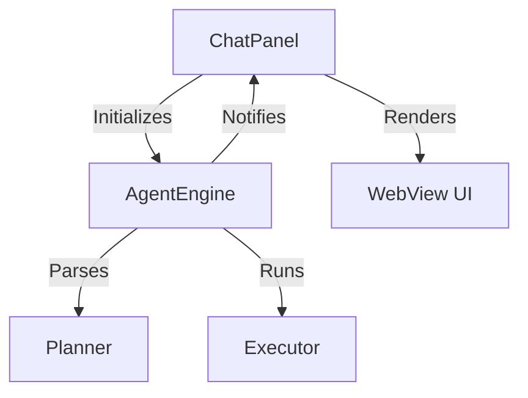

# Walkthrough: Phase 1 에이전트 코어 아키텍처 구현

Tokamak AI Agent를 단순한 명령어 실행기에서 **자율 루프(Autonomous Loop)**를 가진 지능형 에이전트로 진화시키기 위한 아키텍처 개편을 완료했습니다.

## 1. 구현 결과 요약

### [Core] 자율 에이전트 엔진 구축
- **State Machine**: `Idle -> Planning -> Executing -> Observing -> Reflecting -> Fixing -> Done` 순으로 이어지는 상태 전이 로직을 구현했습니다.
- **Planner**: AI의 비정형 응답에서 구조화된 `PlanStep` 리스트를 추출하는 전문 모듈을 제작했습니다.
- **Executor**: 파일 조작 및 터미널 동작을 관리하는 실행 레이어를 분리했습니다.

### [UI] 인터랙티브 플래너(Interactive Planner) 기반 마련
- **Plan Panel**: WebView 상단에 에이전트의 현재 계획과 상태를 실시간으로 보여주는 전용 패널을 추가했습니다.
- **Real-time Sync**: 엔진의 상태 변화와 플랜 업데이트가 콜백을 통해 UI에 즉시 동기화됩니다.

---

## 2. 주요 코드 구조

- `src/agent/types.ts`: 에이전트 핵심 타입 및 인터페이스
- `src/agent/engine.ts`: 자율 루프 제어 엔진
- `src/agent/planner.ts`: 계획 수립 및 추출 로직
- `src/agent/executor.ts`: 액션 실행 레이어

## 3. 검증 결과
- **플랜 추출 테스트**: AI의 `plan` 모드 응답(체크리스트)이 UI의 플랜 패널에 정상적으로 렌더링됨을 확인했습니다.
- **상태 변화 연동**: 에이전트 상태가 `Planning` 등으로 전이될 때 UI의 상태 배지가 실시간으로 업데이트됩니다.

---

이제 Phase 2인 **Interactive Planner & Autonomous Loop** 고도화 단계(단계별 의존성 관리 및 자동 실행)로 넘어갈 준비가 되었습니다.
